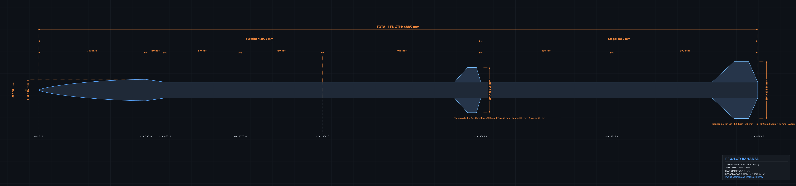

# ork2svg

Convert OpenRocket (`.ork`) designs into publication-ready, dimensioned CAD SVG vector drawings and high-resolution PNG images.



## Features

- **Multi-Format Support:** Seamlessly reads plain XML `.ork`, ZIP-compressed `.ork` (standard OpenRocket), and gzip-compressed files.
- **Analytical Aerodynamic Curves:** Mathematically exact generation of nose cone shapes (Haack series / Von Kármán, Tangent Ogive, Ellipsoid, Conical, Parabolic, Power Series) and transitions.
- **CAD-Standard Dimensioning:**
  - 3-tier horizontal dimension chains: individual components, stage totals, overall length.
  - Vertical diameter dimension callouts with ISO $\varnothing$ diameter symbols.
  - Fin detail annotations (root chord, tip chord, span, sweep length).
  - Axial station markers (e.g. `STA 0.0`, `STA 730.0`, `STA 4885.0`).
  - Standard ISO dash-dot centerline and component junction lines.
- **Multiple Visual Themes:** Modern `dark` (aerospace CAD), classic `blueprint`, or print-ready `light`.
- **High-Resolution PNG Export:** Direct vector-to-raster conversion powered by `resvg-py` with configurable DPI (default 300 DPI) and zoom.
- **OpenFOAM / CFD Ready:** Embedded `<g id="openfoam_axisymmetric_profile">` layer containing a clean closed contour for 2D axisymmetric CFD meshing or 3D revolution in CAD.

---

## Installation

Install locally in editable mode:

```bash
cd "c:\Users\banke\OneDrive\Desktop\abhyuday\year 2\Openrocket Mods\ork2svg"
pip install -e .
```

---

## Command Line Usage

Convert an OpenRocket file to dimensioned SVG and 300 DPI PNG:

```bash
# Basic conversion (generates both SVG and PNG)
ork2svg banana3.ork --png

# Blueprint theme with 4K resolution
ork2svg banana3.ork --png --theme blueprint --png-width 3840

# Print-ready light theme in inches
ork2svg banana3.ork --png --theme light --units in
```

### CLI Arguments

| Argument | Description | Default |
|---|---|---|
| `input` | Path to `.ork` file | *Required* |
| `-o, --output` | Path to output `.svg` | `<stem>_dimensioned.svg` |
| `--png` | Also export high-res PNG | `False` |
| `--png-output` | Explicit PNG output path | `<stem>_dimensioned.png` |
| `--theme` | Theme: `dark`, `light`, `blueprint` | `dark` |
| `--units` | Units: `mm`, `m`, `in` | `mm` |
| `--png-width` | Target PNG width in pixels (e.g. 3840) | SVG native |
| `--png-dpi` | Rasterization DPI | `300.0` |
| `--zoom` | Zoom factor for PNG | `1.0` |
| `--no-dimensions` | Omit dimension lines and text | `False` |
| `--no-stations` | Omit axial station lines | `False` |
| `--no-title-block` | Omit engineering title block | `False` |
| `--no-fins` | Omit fin geometry | `False` |

---

## Python API Usage

```python
from ork2svg import parse_ork_file, SVGRenderer, save_svg, save_png, DARK_THEME

# 1. Parse OpenRocket file
rocket = parse_ork_file("banana3.ork")

# 2. Configure and render SVG
renderer = SVGRenderer(
    rocket=rocket,
    theme=DARK_THEME,
    unit="mm",
    show_dimensions=True,
    show_stations=True,
    show_title_block=True
)
svg_str = renderer.render()

# 3. Save SVG and PNG
save_svg(svg_str, "banana3_dimensioned.svg")
save_png(svg_str, "banana3_dimensioned.png", dpi=300.0)
```
